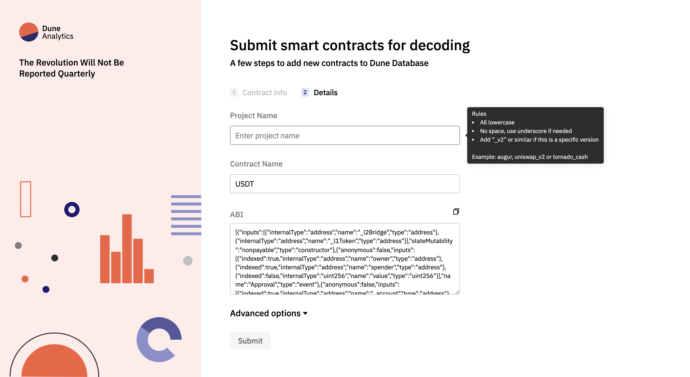
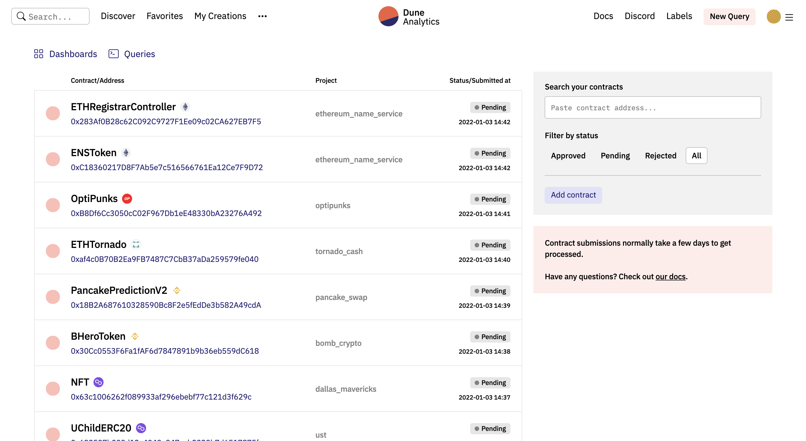
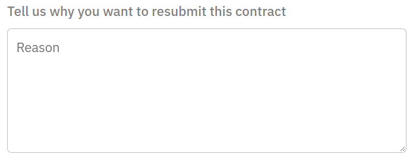

Dune contains an extensive catalog of Decoded Contracts, brought into the platform through Wizard submissions!

Instead of working with raw transaction, log, and trace data, contracts are decoded into human-readable tables for each event and function defined in the smart contract's ABI ([Application Binary Interface](https://www.alchemy.com/overviews/what-is-an-abi-of-a-smart-contract-examples-and-usage)).

Learn more about how Decoding works and what Decoded tables are available [here](../../tables/decoded/).

## Submitting a new contract for decoding

Contracts can be submitted for decoding through:

- [The New contract form](https://dune.com/contracts/new)
- The [My Creations > Contracts Tab](https://dune.com/browse/contracts/authored)
- Within the dataset explorer in the Query editor's sidebar:

The contract submission form, which consists of 2 steps:

### 1. Blockchain and address

We first ask for the contract's address and blockchain. Requesting this data first has two purposes:

1. To enable us to review for potential duplicate contracts and pending submissions.
2. To automate parts of the submission process where we can.

The latter is usually accomplished by fetching potentially useful metadata from Dune and other third party sources where relevant.

For instance, below here's an example of submitting the USDT contract (`0x94b008aA00579c1307B0EF2c499aD98a8ce58e58`) in Optimism:

If we can find the contract through a third party source, we will show a green check mark next to the address field.

This means we were able to fetch information such as the contract's name and ABI (Application Binary Interface).

### 2. Contract details

After pressing Next, we ask for other information about the contract that we need in order to decode it:

If we found the contract through other third party sources, you will only have to fill in the project name.

We have some naming conventions on that, partly due to our technical setup and also to make finding data more predictable.

**Project Names Rules**

- All lowercase
- No spaces (underscore "_" if needed)
- Added "_v2" or other version names at the end if applicable

eg `augur`, `tornado_cash`, `uniswap_v2`

Once you submit it, you are done! The contract will be stored in our queue, which we manually review for quality assurance purposes.

!!! note
    
    Submission might take a few days to get processed, please be patient with us! 🙏

### Advanced options

In some instances, Dune can automatically detect and index multiple contract addresses under the same submission. This is useful for examples such as AMM pools where there often exists one contract instance per pair.

We have two strategies for detecting other contracts for decoding:

1. **Bytecode match.** We use the bytecode of the contract address in the submission to find other matches in the whole chain history.
2. **Factory instances.** We find all other contracts created by the same address as the one responsible for creating the submitted contract.

In both cases, we assume that all the contracts found through either method correspond to the same blockchain, project name, contract name and ABI.

If you want us to index more than one contract, toggle on Advanced options and select "Yes" to the first question, "Are there several instances of this contract?"

Then, to the second question - "Is it created by a factory contract?" - select "No" to index all other contracts with the same bytecode or "Yes" to index all other contracts originating from the same creator:

!!! warning

    Only use these options if you know what you're doing and are extremely familiar with the project's architecture and deployment hierarchy. Incorrectly applying these settings may lead to a rejected submission.

## Tracking your submissions

You can view your submissions and their processing status at any time by navigating to [My Creations > Contracts](https://dune.com/browse/contracts/authored):

### Frequently Asked Questions

#### How do I submit contract information manually?

!!! note
    If the contract being manually submitted is a Proxy contract, we recommend you to move on to the next section.

Although we try to fetch contract information such as the ABI, sometimes this information might not be available through our sources.

In those instances, you will need to manually input the contract's name and its ABI.

If the contract has been verified by the chain's block explorer, you should be able to find this information there.

[Find a list of each chain's main block explorer here](../resources/wizard-tools/blockchain-explorers.md)!

#### How do I submit a Proxy contract?

In order to properly decode transactions towards contracts that fit the [Proxy pattern](https://blog.openzeppelin.com/proxy-patterns/), Dune needs to map the Proxy contract's address with the implementation contract's ABI.

We avoid monitoring the implementation contract's address because its logic is accessed in transactions via the [`DelegateCall` function](https://medium.com/coinmonks/delegatecall-calling-another-contract-function-in-solidity-b579f804178c).

If we did monitor the implementation contract's address directly, we would miss out on any event logs in its logic since these are actually fired by the caller (the Proxy in this case) when calling a function through `DelegateCall`.

!!! warning
    When submitting Proxy-patterned contracts to Dune, you should input the Proxy contract's address and, if you have it, the Implementation contract's ABI.**

When you submit the Proxy contract's address, we'll attempt to fetch the proxy's contract name and the implementation address it's pointing towards to source the Implementation contract's ABI.

If we can't find the Implementation contract's ABI, you'll need to find it using [the relevant chain's blockchain explorer](../resources/wizard-tools/blockchain-explorers.md) and input it manually.

#### How do I re-submit a contract?

Dune assumes each address in the blockchain can map to at most 1 contract. For this reason, submitting a contract with an address that already exists in `[blockchain].contracts` will override it for Decoding purposes.

This has a couple potential dangerous side effects:

- If the project or contract name has changed, we will generate new tables for all of the contract's methods and events. In turn, previous tables will stop updating, data will be fragmented, and Queries will stop working.
- If the ABI has changed in a way that modifies an existing table's parameters, Queries that depend on such table might break or become inaccurate.

If you attempt to submit a contract that already exists, we'll first present a warning note and ask you to confirm you want to proceed:

Then, at the bottom of the Details page, we'll ask you to explain why you're resubmitting the contract so we can assess whether it's worth overriding the contract's data:

If we believe the risk of accepting a re-submission is higher than the added value, we'll reject your resubmission.

If you think we're wrong (we're only human!), feel free to reach out in our [#decoding Discord channel](https://discord.com/channels/757637422384283659/850326962152538122) and we'll discuss it further with you!

#### How do I submit Diamond Proxy contracts?

Similar to vanilla Proxy contracts, [EIP-2535](https://eips.ethereum.org/EIPS/eip-2535) contracts can be supported by passing in the address of the Diamond Proxy as well as **a single ABI representing the totality of all the facets interfaces**.

#### My submission got rejected, why?

In the interest of data quality, we reject duplicative, incorrect or low quality submissions. To avoid rejection, be sure to submit accurate contract information! 🙏

#### For all other questions:

Head over to the [#decoding Discord channel](https://discord.com/channels/757637422384283659/850326962152538122) and we'll be happy to help!
