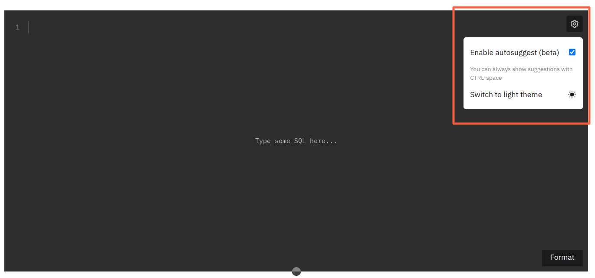

The Query window is where you work your Dune 🪄 by inputting SQL code and running it.

## Autocomplete

You can enable/disable the autocomplete function of the Query editor using the gear wheel in the top right corner:

The autocomplete feature will bring up PostgreSQL keywords, as well as tables and aliases you've already included in your Query.

## Run Selection

To save yourself time while testing and debugging your Queries, you can run just a part of your Query.

To do this, highlight a part of your Query. You'll then see the Run button turn into a Run selection button.

Click and 🪄

You'll need to highlight a syntactically complete and correct piece of SQL otherwise you'll get an error:

## Shortcuts

Here are a handful of shortcuts to make crafting Queries a 💨

| Shortcut      | Action                         |
| ------------- | ------------------------------ |
| ctrl + enter  | execute the Query              |
| ctrl + # or / | comments out the selected code |
| ctrl + space  | brings up a list of keywords   |
| crtl + z      | undoes your last changes       |
| ctrl + y      | redoes your last changes       |
| ctrl + f      | search for keywords            |
| ctrl + h      | search and replace keywords    |

_These shortcuts work on US/UK Keyboards and might vary based on the language setting on your machine._