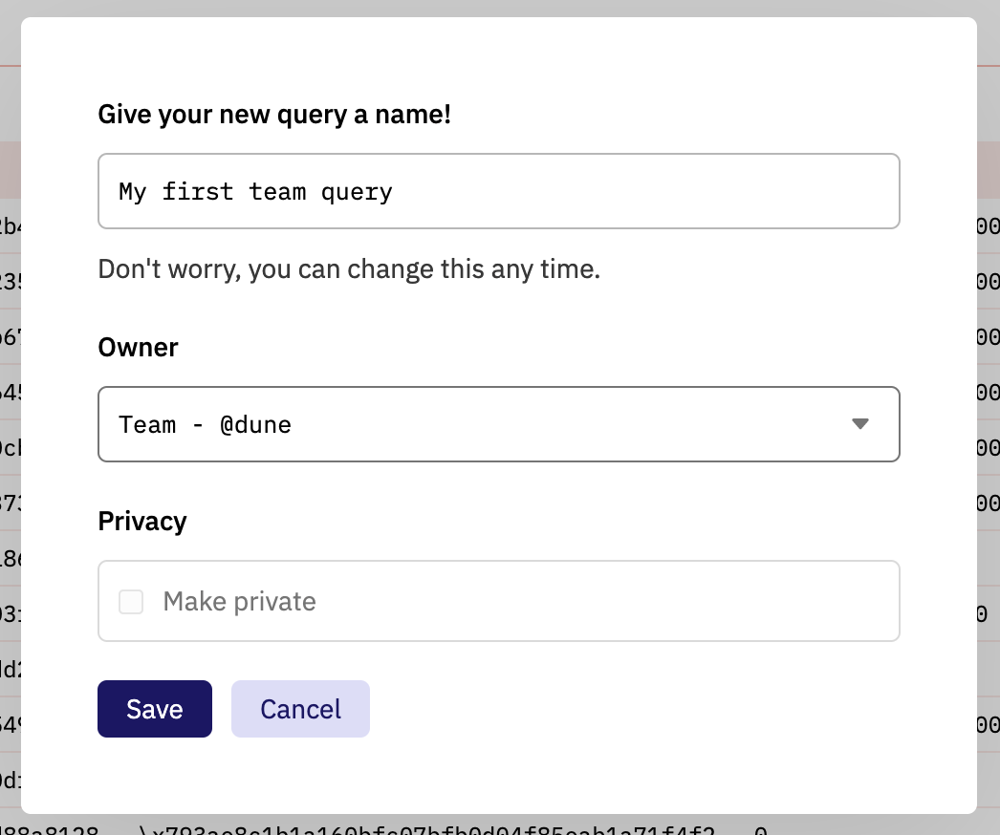

# Teams

### Introduction

It is now possible to create teams on Dune. **A Team is a shared workspace for wizards to work together and share their work under a single shared entity.** As such, teams can own content and have their own profile page, allowing for seamless collaboration and serving as a promotional tool.

### Purpose

Creating a team several benefits:

1. **🤝 Collaborate on the same content.** Let team members work on shared queries and dashboards.
2. **🗂 A separate workspace for each team.** Keep your personal work separate from the teams you work with. Easily access your team’s queries and dashboards through My Creations.
3. **🖼 A new team profile.** Showcase all of your team’s work in one place.
4. **👥 User roles.** Onboard team members as viewers, editors or admins.

### Getting started

#### Creating a team

Head over to [**Settings > Teams**](https://dune.com/settings/teams) to create your team.

Make sure to pimp up your team’s profile. Here is ours: [**@dune**](https://dune.com/dune)

#### Adding users

You can invite other Dune users to join your team in the People section within your team’s Settings page. When you invite someone you have to specify:

* **Dune Username.** If they’re not a Dune user they will have to sign up first.
* **Role**
    - 👀 **Viewer:** can see the team’s content through My Creations and will be listed as a team member in the team page.
    - ✏️ **Editor:** in addition to the above, they can create and edit queries under the team’s domain.
    - ⚙️ **Admin:** in addition to the above, they can manage the team and its content.

!!! info
    Once the user has been invited, they will receive an email. They can also directly go to [Settings > Teams](https://dune.com/settings/teams), and accept their invite there.

#### Team content

Team queries and dashboards are created as you normally would. When you’re prompted to save it for the first time, you can pick your team as the Owner so your teammates can also access it:

#### Transferring content to the team

You can transfer a query or a dashboard owned by you to your team by going to the query or dashboard’s settings and changing the owner there:

!!! warning
    Once you transfer content to a team, you will only be able to transfer it out of the team if you are an Admin. If you accidentally transfer content to a team you will have to ask your team's Admin to transfer it back to you.

#### Finding your team’s content

Go to My Creations. Here you can see all of your personal content as well as your team’s. You can filter by owner to narrow down your search:

### FAQ

**Can I haz private content?** 🥷

We’re planning to add support for private content in teams later this year. Stay tuned!

**I have feedback, how do I reach out?**

Come join our #feedback channel on Discord and we'll be glad to help 🙇‍♂️
