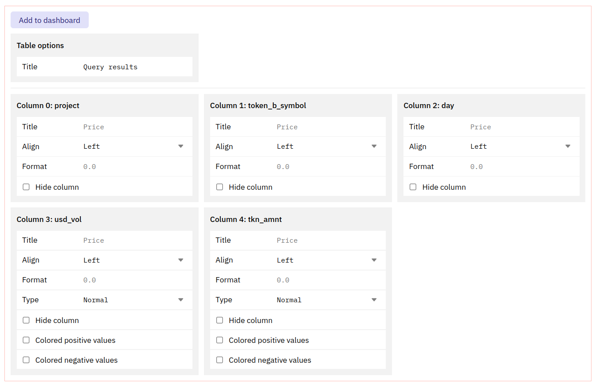

Here are a few non-graph visualizations you can make with Dune!

## Tables

Tables are the default Visualization you'll find labeled Query results whenever you create and run a Query:

You can also make more Tables to display your data differently using the New visualization button and drop down menu:

### Configuring your Table

#### Table options

**Title**

The Title appears at the top of your Table.

Leaving default value (`Table`) or making this blank makes your Table title the same as your Query's title/name.

Adding any other value to this field will add that value first, followed by your Query Name:

Note: the default value for "Query Results" is treated like an added value.

#### "Column [x]:" options

You can configure the following options for each column in your Table

=== "Title"

    The Title appears at the top of your Table.

    Leaving this blank makes your column title the same as your it's Dune database name.

=== "Align"

    This changes the text alignment for the column data and title.

=== "Format"

    Allows you to adjust the numerical format of your data following the [X/Y-axis Tick and Label formats here](../visualizations/charts-graphs.md#xy-axis-tick-and-label-formats).

=== "Hide Column"

    Hides this column from your table.

***

#### Numerical Column options

Columns that return numerical data have these additional options:

=== "Type"

    - `Normal` simply displays the column's numerical data.
    - `Progress bar` shows the column's numerical data with a progress bar visual that is "full" for the columns highest value and "nearly empty" for the columns lowest value, with the rest of the data ranging in between:

    

=== "Colored Values"

    Check these boxes to color Positive Values Green and Negative Values Red.

***

## Counters

Counters are a great way to provide your audience with immediate "on a glance" stats.

### Configuring your Counter

#### Counter options

In this section you can define what kind of data the counter should display.

=== "Title"

    * The Title will appear in all instances of this graph prominently at the top
    * If left blank the Query name will be the only thing that is left standing

=== "Column"

    * In this field you can define which column the counter should show.

=== "Row"

    * This field can be used to define which row of the underlying data table you want displayed e.g. row 1
    * Usually this requires you to sort or limit your Query results in order for row 1 to show the wanted results.

***

#### Formatting

This section is where you can adjust how your numerical data is displayed.

=== "Prefix"

    * This field allows you to define a prefix for your counter value.
    * e.g.: `$`, `€`, `Ξ`, `฿`

=== "Suffix"

    * This field allows you to define a suffix for your counter value.

=== "Label"

    * This field allows you to define a label for your counter value.
    * The label will appear beneath the counter value as text.

=== "Decimals"

    * In this field you can choose how many decimals you want displayed for your counter
    * This is currently limited to 3 decimal places.

***

