The Data Explorer empowers you to search for blockchain and other data to use in your Queries (learn about all the data Dune offers in the [Tables section](../../reference/tables/index.md)).

To find the data you're looking for, first select which database you want to search in:

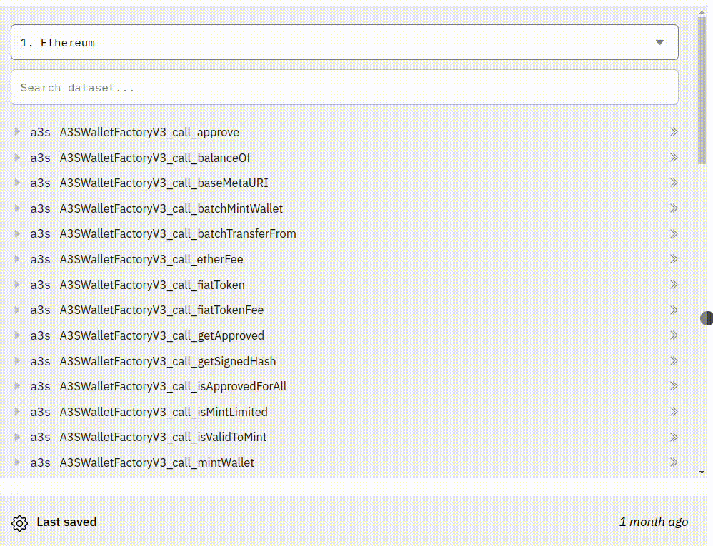

Then simply enter any keywords, protocol names, contract names, or event names into the search bar at the top.

This will bring up a list of [Tables](../../reference/tables/index.md) containing blockchain data you can use to your Queries! 🧙

## Advanced Searching in Dune V2 and V1

If you've selected one of the blockchain databases available in the dropdown, see the v1 tab below.

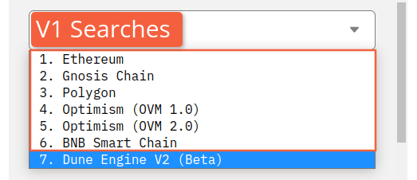

If you've selected the Dune Engine V2 (beta) database, see the V2 tab.

Learn about the [differences between V1 and V2 data sets here](../../dune-v2/).

=== "V2"

    ## V2

    !!! warning
        Like all of Dune V2, the V2 Data Explorer is still in beta. So it might function slightly differently than described here as we're actively testing and iterating ways to make it even better! If you have a suggestion for how to make the V2 Explorer work better, [add it on our Feedback board](https://feedback.dune.com/)! If you have a suggestion for how to make these docs better, make an edit and submit a Pull Request on [this page's Github](https://github.com/duneanalytics/docs/edit/master/docs/features/queries/data-explorer.md)!

    One of the biggest changes in [Dune V2](../../dune-v2/) lies in our data structure - instead of having data siloed into separate databases by blockchain, everything is accessible in one data lake.

    One way you'll experience the power of this change is in your Queries - with V2 you can incorporate data from multiple chains in one SQL query!

    You'll also notice this in how searching works in the Data Explorer.
    
    To get started exploring Dune V2, select it from the dropdown list instead of one of the individual chains:

    

    Here you'll find a search bar that searches all the data inside Dune V2 and 4 different categories of dataset:

    1. [**Raw**](../../reference/tables/raw/index.md) - just like it sounds, raw data straight from the blockchain
    2. [**Decoded Projects**](../../reference/tables/decoded/index.md) - contract calls and events from projects the Dune Team and Community have organized into nice human-readable tables.
    3. [**Spells**](../../reference/tables/spells/index.md) - standardized project and sector data (dex.trades, nft.trades, erc20.stablecoins, etc)
    4. [**Community**](../../reference/tables/community/index.md) - off-chain data supplied by the web3 community.

    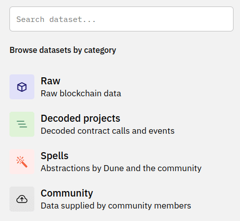
    
    ### Searching Dune V2

    When you search from the main page using keywords, you'll be searching all of Dune V2 - which is awesome for exploring all available data when you're not quite sure what you're looking for.

    !!! note
        The Dune V2 explorer is not case sensitive.

    However, since the explorer needs to look through all that data to find matches for your keywords, these searches will also have the most wait time.

    So if you know you're looking for data in one of the specific categories listed above, click into that category and do your searching there for better speed!
    
    Keep in mind, when you search within a specific dataset inside the V2 data explorer, you'll only find data within that set.

    For example, if we search for Aave at the main level, we'll find all Decoded tables as well as Aave related Spells:

    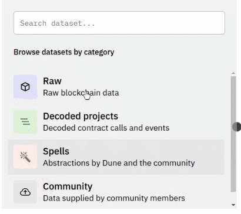

    However, if we click into the Raw dataset, we won't find anything as this limits our search just to raw blockchain data:

    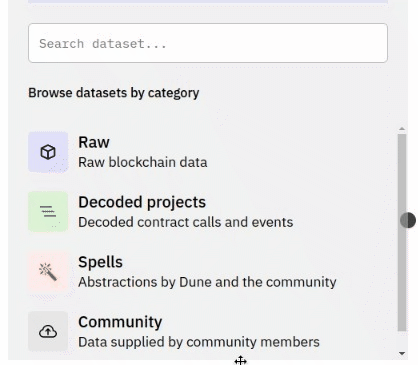

    This functionality works recursively - when you leave the main V2 search bar, your keyword searches are limited to the specific dataset level you're currently in.

    To see how this works, let's start by clicking into Decoded projects and searching for Aave there:

    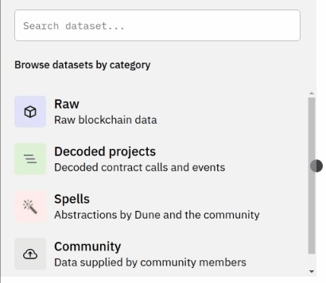

    Here we've found protocols that include Aave in their name, as well as the different versions of Aave itself (just like protocols will publish groups of contracts as v1, v2, etc versions, we group the data in our decoded projects that way to keep things organized like they are on-chain).

    Clicking one level deeper into `aave_v2`, we'll see all the contracts associated with the v2 version of Aave:

    

    See the `AaveEcosystemReserve` contract?

    Let's back up one level by clicking "aave v2" at the top:

    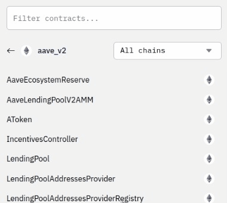

    Then try searching `AaveEcosystemReserve` here: 

    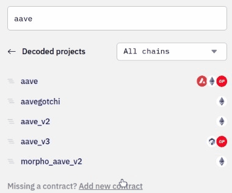

    As you can see, no results were returned since we're one level above the depth that `AaveEcosystemReserve` is in.

    The same thing happens if we go further down!

    Clicking into the AToken contract, we'll find all the functions and events contained within that contract:

    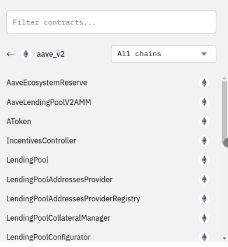

    But if we try searching for `AaveEcosystemReserve` here...

    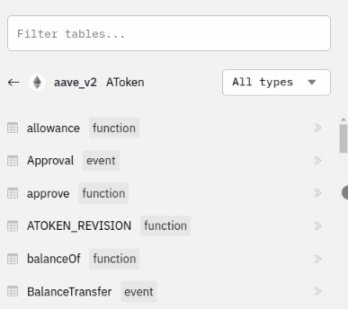

    No luck.

    Likewise, if we click back up to the `aave_v2` protocol version level, with all the Aave v2 contracts, and search for the `approve` function that exists within the `AToken` contract:

    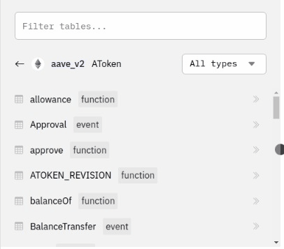

    We won't get any results.

    Finally, as you may have noticed above, the Raw, Decoded Projects, and Spells datasets can all be searched by `All chains` or by specific chains.

    Just as we've seen, if you limit your search with this dropdown, you'll both get results faster and not be able to find results from other chains.

    

    Lastly, you can search within smart contracts for certain Table types, eg `function` and `event` either with the dropdown:

    

    Or for certain data types within a `function` or `event` using the search box:

    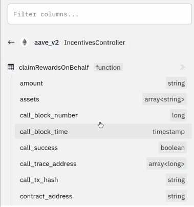

    ### Icons and Labels

    First, anytime you see a double arrow `>>` Icon, you can click them to add that Table or data point name to your Query:

    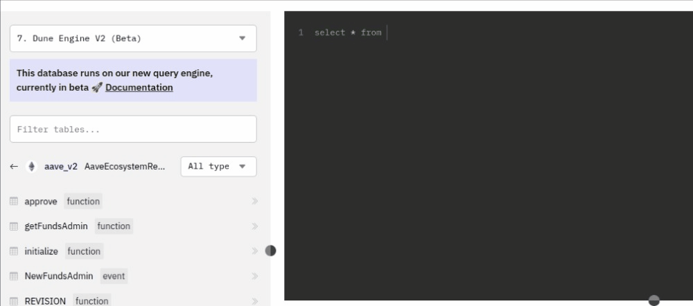
    
    We've tried to make V2 search more ✨ with the use of icons and labels for:

    1. Which blockchain a Spell, Protocol contract set, or individual contract belongs to.
    2. Whether a piece of data/dataset is a Spell, Decoded Contract, or Community Dataset - of of which contain multiple data Tables - or an individual Table.
    3. Whether a Table within a Decoded Contract is a Function or Event.
    4. Whether a Spell set is for a Project or Sector.
    5. What type a piece of data is.

    [Find descriptions of what all the icons and labels mean here](../../reference/types-labels.md)!

    In cases where the icon is different than a blockchain name next to a contract/data set, the icon is the blockchain that data is on. EG these are Polygon bridge contracts on the Ethereum Chain:

    

=== "V1"

    ## V1

    ### Searching by Keyword

    Searching for just `uniswap` will bring up all tables that contain the keyword `uniswap` in some form.

    

    Use spaces to create multi-keyword searches.

    

    ### Finding Specific Schemas

    Searching for `uniswap_v2.` will bring up all tables related to the `uniswap_v2` schema specifically.

    In Dune's V1 Engine, adding "." at the end specifies you're looking for data in this exact schema of tables. Without the "." at the end you'll also find a lot of data that includes references to, in this example, `uniswap_v2.`.     

    

    ### Finding Events, Calls, or Contracts

    Searching for `uniswap_v2. evt` will bring up only event tables related to the `uniswap_v2` schema. 

    Likewise `call` will bring up calls, and searching for a specific `{{contractName}}` will bring up all the data for that contract.

    

    ### Finding Specific Contract Data

    Click a Table name to see a list of all the columns inside that contract's table:

    

    ### Adding References to the Query Window

    To add references to the contract tables, click the `>>` next to the Table name:

    

    To reference specific data within a Table, click its name:

    

