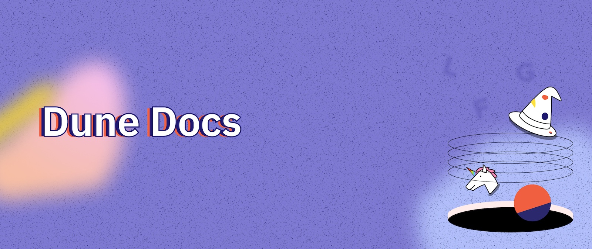
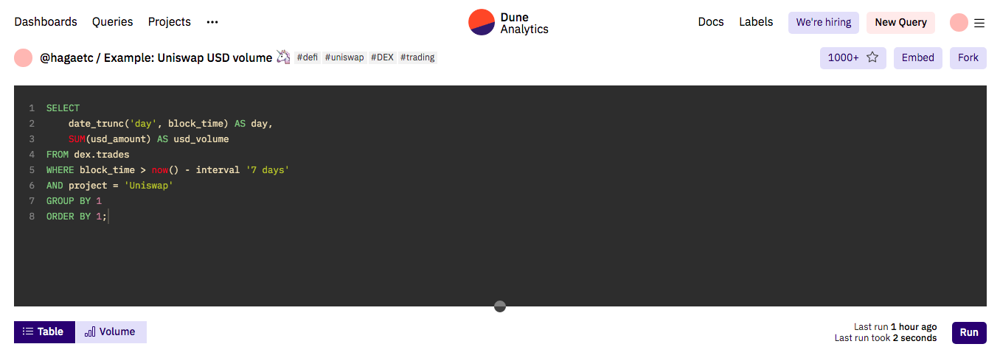

Dune is a powerful tool for blockchain research, complete with all the tools you need to discover, explore, and visualize vast amounts of blockchain data.

 Dune is your key to answering questions questions like:

- [How much volume flows through Uniswap each day?](https://dune.com/queries/3)
- [Which Dex has the highest volume?](https://dune.com/queries/1847)
- [How are important Stablecoins behaving today?](https://dune.com/hagaetc/stablecoins)

## The ⚡ Quick 5-minute Dune overview

## How Dune works

First and foremost, Dune is a data platform that ingests difficult-to-access blockchain data and makes it accessible via a SQL database.

Using SQL queries, you can quickly search for and extract a wide variety of blockchain information from our database, then transform it into human-readable Tables and Visualizations.

Dune has both raw blockchain data and decoded blockchain data available. 

Decoded data is only available if somebody specifically asked us to decode the contract, which you can do via our [submission form here](https://dune.com/contracts/new) (while logged into your Dune account).

You can currently query data from:

- **Ethereum**
- **Polygon**
- **Binance Smart Chain**
- **Optimism**
- **Gnosis Chain**

Dune picks up events and internal calls from the blockchains we index, we don't have state/storage data.

## Dune.com

Dune.com is the first killer app built on top of the Dune Data Platform, designed to make it as easy as possible for anyone with at least a little bit of SQL, Etherium Virtual Machine, and Business knowledge to analyze blockchain data in interesting ways.

The basic building blocks of the Dune.com app are:

- **Dashboards:** A set of widgets containing Visualizations and text that tell a story about a particular group of blockchain data.
- **Visualizations:** Charts and Graphs that turn data in harder-to-understand table-form into easier-to-understand visual form.
- **Queries:** Commands that extract data from Dune's database so it can be displayed in Dune Dashboards via Tables and Visualizations.

As a Dune.com visitor, you view Dashboards containing text, Table, and Visualization widgets built from Queries.

As a Dune Wizard (what we call "blockchain analysts" because it's way cooler), you'll create custom Queries to fetch data, visualize the results of these Queries, and then tell stories with your data using Dashboards.

### Queries

Dune aggregates blockchain data into an SQL database that can be easily queried. 

[Queries](features/queries) are used to specify what data from the blockchain should be found in the our database and returned.

Maybe you want to know _all the Dex trades that happened today_, or the _total value of stablecoins minted this year_. Whatever the question, discovering the answer starts with a Dune Query!

Queries return rows and columns of data (just like traditional SQL queries) that can then be used to create Visualizations that you present in Dashboards.

There are a few ways that a blockchain analyst (i.e. Wizard i.e. you!) can get started running Queries:

1. The simplest way is to use Dune [_Abstractions_](tables/spells) to query commonly used data tables. Some popular Abstractions include `dex.trades`, `lending.borrow`, and `stablecoin.transfer`.
2. Query the raw Ethereum data like blocks, logs, and transactions.
3. It is also possible to query centralized exchange data. For example, you can use `prices.usd` to quickly return the price of almost any cryptoasset.

### Visualizations

Data presented in table form (rows and columns) can be difficult to read. [Visualizations](features/visualizations) take the results of a Query and present the information in a clear, precise, and _visual_ way.

With Dune Visualizations, it's easy to begin to tell a story with your data by transforming something like this:

Into something like this:

The Bar Chart Visualization makes it clear that April 19th had the highest transfer volume to help you and others see the trend over time.

Dune offers a variety of Visualizations you can use to visually present data including:

- **Bar Charts**
- **Area Charts**
- **Scatter Charts**
- **Line Charts**
- **Pie Charts**
- **Counters**
- **Tables**

### Dashboards

Using carefully planned visuals, a clever blockchain analyst (Wizard!) can tell a story about different collections of data through [Dune Dashboards](features/dashboards).

For example, in the below Dashboard, [Dex Metrics](https://dune.com/hagaetc/dex-metrics) by [@hagaetc](https://dune.com/hagaetc), it's clear at the top that 'DEX' as a category is growing. Below, the audience sees which DEX's are the most popular by volume, and finally can view a stacked bar chart that shows changes over time.

Just by looking at this single Dashboard, anyone can get a clear picture of the entire DEX market.

## Dune is a community effort

On Dune.com, all Queries and datasets are public by default (if you need Privacy for your Queries, our [Pro Plan](https://dune.com/pricing) has got you covered).

This makes it a snap for you, the Wizard, to fork and remix other creators' Queries to build on top of their knowledge and insights.

On the flip side, every new Query, you create helps other people learn new things about blockchains and cryptoassets through Dune.

This positive feedback loop is how the Dune Community Succeeds together through an ever growing range of Queries that allow us all to learn more!

Join our [Community Discord](https://discord.gg/BJBHFR6sdy) to get world class support from our team and the community.

And if you have any feedback, whether feature requests or bug reports, please submit it [here](https://feedback.dune.com/).
