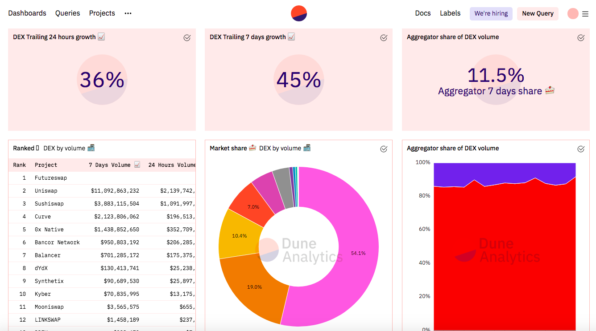

# Home

## Introduction

**Dune is a powerful tool for blockchain research. Dune gives you all the tools to query, extract, and visualize vast amounts of data from the blockchain. Dune is unlocking the power of public blockchain data by making it accessible to everyone. This documentation will help you answer questions like:**

- [How much volume flows through Uniswap each day?](https://dune.com/queries/3)
- [Which Dex has the highest volume?](https://dune.com/queries/1847)
- [How are important Stablecoins behaving today?](https://dune.com/hagaetc/stablecoins)

## Dune Basics

#### Dune App

While navigating Dune, it helps to have a good understanding of [queries](#queries), [visualizations](features/visualizations), and [dashboards](features/dashboards). These are the basic building blocks that act as your portal to the world's blockchain information. As a blockchain analyst, you can create custom queries to fetch data, visualize the results of these queries, and then tell stories with your data using dashboards.

#### Data available on Dune

Behind the scenes, Dune transforms difficult-to-access data into human-readable tables. Using SQL queries, you can query for exactly the information you need.

Dune has raw blockchain data and decoded blockchain data available. Decoded data is only available if somebody signaled to us before that a contract needs to be decoded. You can signal a decoding request to us via our [website](https://dune.com/contracts/new).

You can currently query data from **Ethereum, Polygon, Binance Smart Chain, Optimism** and **Gnosis Chain**.

Dune picks up events and internal calls from the blockchains we index, we don't have state/storage data.

## Queries

Dune aggregates blockchain data into SQL databases that can be easily queried. Queries are used to specify what data from the blockchain should be returned.

Maybe you want to know _all the Dex trades that happened today_, or the _total value of stablecoins minted this year_. Whatever the question, the answer likely starts with a Dune query.

Queries return rows and columns of data (same as traditional SQL queries) that can later be visualized and presented.

There are a few ways that a blockchain analyst (ie. you!) can get started running queries:

1. Use Dune _abstractions_ to query commonly used data tables. This is the simplest and most common way to use Dune. Some popular abstractions include `dex.trades`, `lending.borrow`, and `stablecoin.transfer` (you can find a complete list of abstractions [here](https://github.com/duneanalytics/abstractions))
2. Query the raw ethereum data including blocks, logs, and transactions.
3. It is also possible to query centralized exchange data. Use `prices.usd` to quickly return the price of almost any cryptoasset

## Visualizations

Data presented in table form (rows and columns) can be difficult to read. Visualizations take the results of a query and present the information in a clear & precise way.

You can use visualizations to begin to tell a story with your data. With Dune visualizations it is easy to transform this:

Into this:

The bar chart visualization makes it clear that April 19th had the highest transfer volume, and helps the audience see the trend over time.

Dune offers a variety of visualizations that you can use to visually present data including bar charts, area charts, line charts, pie charts, and more.

## Dashboards

Using carefully planned visuals, a clever blockchain analyst can tell a story about a particular group of data. For example, in the below [dashboard](https://dune.com/hagaetc/dex-metrics) it is clear at the top that 'Dex' as a category is growing. Below, the audience sees which dex's are the most popular by volume, and finally can view a stacked bar chart that shows changes over time. By just looking at this single dashboard, the audience sees a clear picture of the entire DEX market.

## Dune is a collaborative effort

On Dune, all queries and datasets are public by default.

This introduces an interesting dynamic in which you, the user, can fork and remix the queries of other creators with ease and build on top of their knowledge. On the other side, every time you write a new query, you contribute to the collection of queries that help people query for data on dune. That way, the Dune Community succeeds together through an ever improving range of queries that allow you to easily query for just the stats you need.

If you do need Privacy for your Queries, the [pro Plan](https://dune.com/pricing) has got you covered.

Join our [Community Discord](https://discord.gg/BJBHFR6sdy) to get world class support from our team and the community.

If you have any feedback, whether feature requests or bug reports, you can submit it [here](https://feedback.dune.com/).
